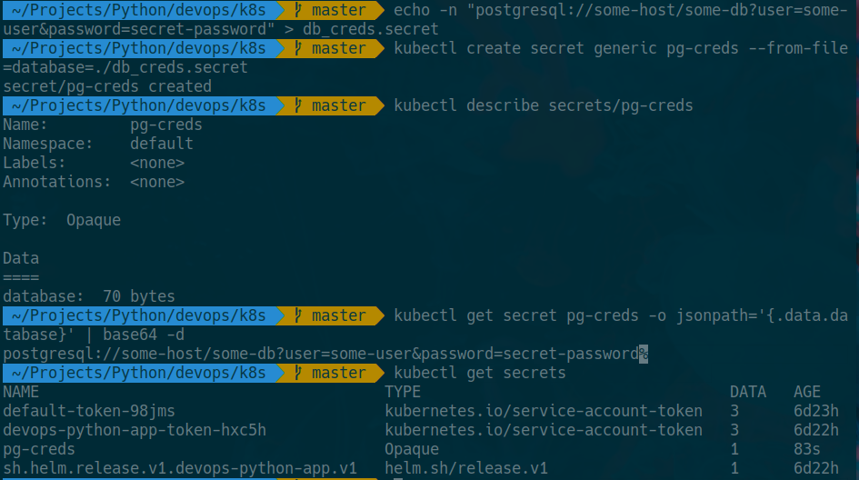
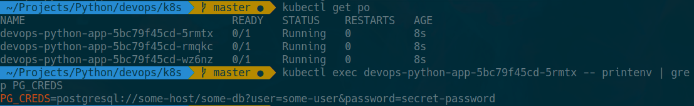

# Lab 11

## Secrets

1. Creating secret 
```
>>> echo -n "postgresql://some-host/some-db?user=some-user&password=secret-password" > db_creds.secret

>>> kubectl create secret generic pg-creds --from-file=database=./db_creds.secret
secret/pg-creds created
```

2. Check secrets
```
>>> kubectl get secrets
NAME                                      TYPE                                  DATA   AGE
default-token-98jms                       kubernetes.io/service-account-token   3      6d23h
devops-python-app-token-hxc5h             kubernetes.io/service-account-token   3      6d22h
pg-creds                                  Opaque                                1      15s
sh.helm.release.v1.devops-python-app.v1   helm.sh/release.v1                    1      6d22h

>>> kubectl describe secrets/pg-creds 
Name:         pg-creds
Namespace:    default
Labels:       <none>
```

3. Read secrets
```
>>> kubectl get secret pg-creds -o jsonpath='{.data.database}' | base64 -d
postgresql://some-host/some-db?user=some-user&password=secret-password%
```



## Secrets using `helm`

1. Create secrets.yml
```
apiVersion: v1
kind: Secret
metadata:
  name: {{ .Values.secret.name }}
  labels:
    {{- include "devops-python-app.labels" . | nindent 4 }}
type: Opaque
data:
  pg_creds: {{ .Values.secret.pg_creds | b64enc | quote }}
```

Inside values.yaml add:
```
secret:
  name: database
  pg_creds: "default_creds"
```

Inside deployment.yaml add:
```
env:
  - name: PG_CREDS
    valueFrom:
      secretKeyRef:
        name: {{ .Values.secret.name }}
        key: pg_creds
```

2. Reinstall app
```
>>> export PG_CREDS="postgresql://some-host/some-db?user=some-user&password=secret-password"
>>> helm package devops-python-app
>>> helm install --set secret.pg_creds=$PG_CREDS devops-python-app ./devops-python-app-0.1.0.tgz
```

3. Get pods
```
>>> kubectl get po                        
NAME                                 READY   STATUS    RESTARTS   AGE
devops-python-app-5bc79f45cd-5rmtx   0/1     Running   0          8s
devops-python-app-5bc79f45cd-rmqkc   0/1     Running   0          8s
devops-python-app-5bc79f45cd-wz6nz   0/1     Running   0          8s
```

Check your secret inside pod, example:
```
>>> kubectl exec devops-python-app-5bc79f45cd-5rmtx -- printenv | grep PG_CREDS
PG_CREDS=postgresql://some-host/some-db?user=some-user&password=secret-password
```



## Resource limits

In values.yaml add 
```
resources:
  limits:
    cpu: 200m
    memory: 256Mi
  requests:
    cpu: 100m
    memory: 128Mi
```
