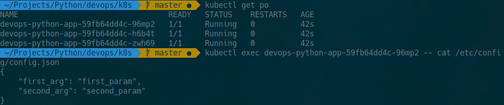

# Lab 12

1. Update `deployment.yaml`:
```
    volumeMounts:
      - name: config
        mountPath: "/etc/config"
        readOnly: true
volumes:
  - name: config
    configMap:
      name: {{ include "devops-python-app.fullname" . }}
```

2. Create sample config:
``` json
{
    "first_arg": "first_param",
    "second_arg": "second_param"
}
```

3. `configmap.yaml` configuration file:
```
apiVersion: v1
kind: ConfigMap
metadata:
  name: {{ include "devops-python-app.fullname" . }}
  labels:
    {{- include "devops-python-app.labels" . | nindent 4 }}
data:
{{ (.Files.Glob "files/*").AsConfig | indent 2 }}
```

4. Check deployment:
```
>>> kubectl get po
NAME                                 READY   STATUS    RESTARTS   AGE
devops-python-app-59fb64dd4c-96mp2   1/1     Running   0          42s
devops-python-app-59fb64dd4c-h6b4t   1/1     Running   0          42s
devops-python-app-59fb64dd4c-zwh69   1/1     Running   0          42s

>>> kubectl exec devops-python-app-59fb64dd4c-96mp2 -- cat /etc/config/config.json
{
    "first_arg": "first_param",
    "second_arg": "second_param"
}
```


