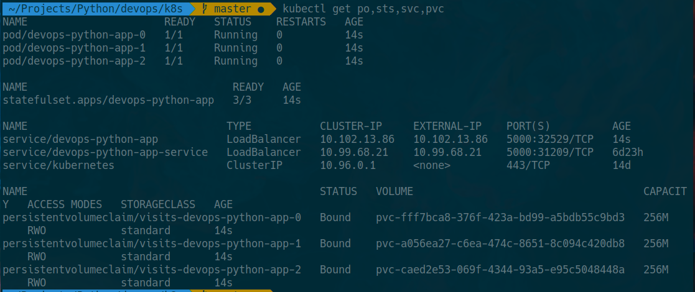
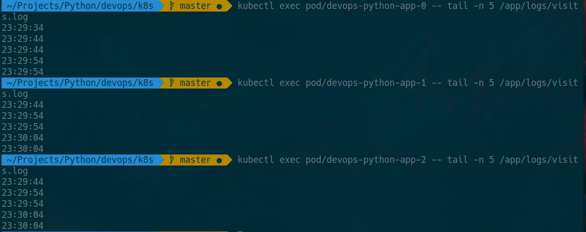

# Helm StatefulSet

## Proceeded steps

1. `kubectl get po,sts,svc,pvc` output:
``` 
>>> kubectl get po,sts,svc,pvc
NAME                      READY   STATUS    RESTARTS   AGE             
pod/devops-python-app-0   1/1     Running   0          7m49s
pod/devops-python-app-1   1/1     Running   0          7m49s
pod/devops-python-app-2   1/1     Running   0          7m49s

NAME                                 READY   AGE
statefulset.apps/devops-python-app   3/3     7m49s

NAME                                TYPE           CLUSTER-IP       EXTERNAL-IP      PORT(S)          AGE
service/devops-python-app           LoadBalancer   10.109.190.243   10.109.190.243   5000:31553/TCP   7m49s
service/devops-python-app-service   LoadBalancer   10.99.68.21      10.99.68.21      5000:31209/TCP   7d
service/kubernetes                  ClusterIP      10.96.0.1        <none>           443/TCP          14d

NAME                                               STATUS   VOLUME                                     CAPACITY   ACCESS MODES   STORAGECLASS   AGE
persistentvolumeclaim/visits-devops-python-app-0   Bound    pvc-fff7bca8-376f-423a-bd99-a5bdb55c9bd3   256M       RWO            standard       41m
persistentvolumeclaim/visits-devops-python-app-1   Bound    pvc-a056ea27-c6ea-474c-8651-8c094c420db8   256M       RWO            standard       41m
persistentvolumeclaim/visits-devops-python-app-2   Bound    pvc-caed2e53-069f-4344-93a5-e95c5048448a   256M       RWO            standard       41m
```



2. Access our service several times from different environmets;

3. Obtain visits logs from each pod;
```
>>> kubectl exec pod/devops-python-app-0 -- tail -n 5 /app/logs/visits.log
23:29:34
23:29:44
23:29:44
23:29:54
23:29:54

>>> kubectl exec pod/devops-python-app-1 -- tail -n 5 /app/logs/visits.log
23:29:44
23:29:54
23:29:54
23:30:04
23:30:04

>>> kubectl exec pod/devops-python-app-2 -- tail -n 5 /app/logs/visits.log
23:29:44
23:29:54
23:29:54
23:30:04
23:30:04
```



4. Explaination of differences between the output of the command for replicas:

    All pods are tring to read from a singular. It has no locks which leads to inconsistancy due to race conditions and performance degradation. To prevent it, the Stateful state utilizes `volumeClaimTemplates` making all instances operating over different copies of a signle files. It leads to difference in results.
    
5. Why ordering guarantees are not necessary in our case:

    In some cases, we want to preserve ordering, for example when we need to start-up a master node first, then connect some workers to it. Our instances are independent of each other, therefore ordering is unnecessary.
    
6. Launching pods in parallel.

We need to update our `values.yaml` and add:
```
statefulSet:
  podManagementPolicy: "Parallel"
  volumeClaimTemplates:
    spec:
      accessModes: [ "ReadWriteOnce" ]
      resources:
        requests:
          storage: 256M
```
