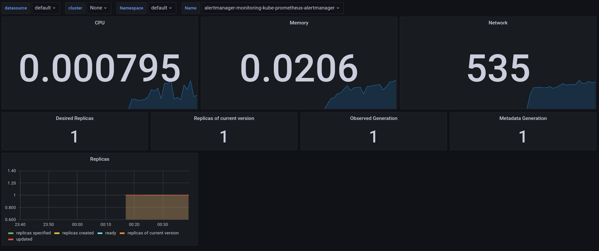
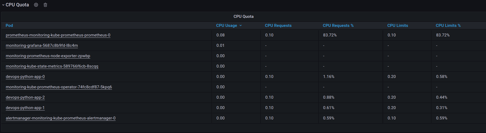
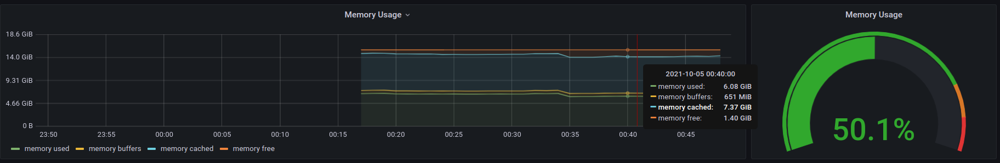
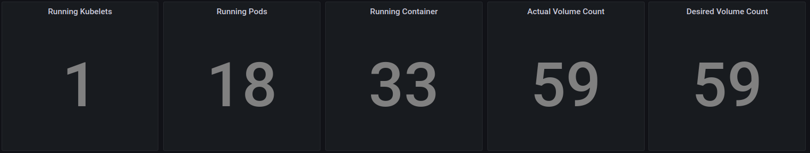
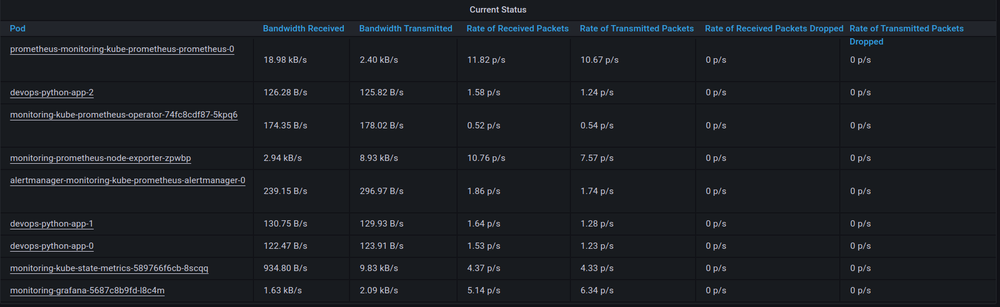
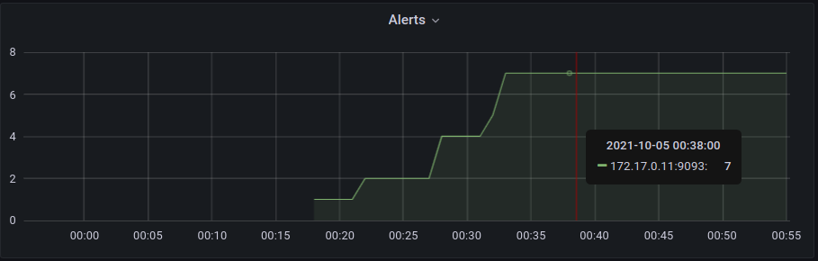
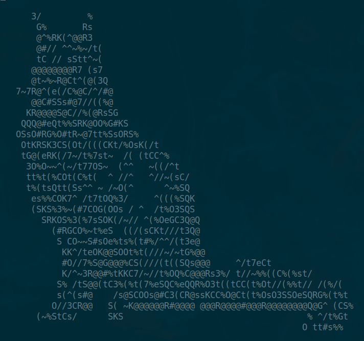

# Lab 14. Kubernetes - Prometheous

## Components

- [Grafana](https://grafana.com/)

  Visualisation tool

- [Prometheus](https://prometheus.io/)

  Time-series database that commonly used as metrics storage. Have multiple build-in data types.

- [Prometheus Operator](https://github.com/prometheus-operator/prometheus-operator)

  Kind of "plugin" which automates deployment of prometheous inside Kubernetes.

- [kube-state-metrics](https://github.com/kubernetes/kube-state-metrics)

  Export various metrics related to each type of K8s component.

- [Prometheus Adapter for Kubernetes Metrics APIs](https://github.com/DirectXMan12/k8s-prometheus-adapter)

  Adapter that collects K8s metrics and serves them in prometheus format.

- [Prometheus node-exporter](https://github.com/prometheus/node_exporter)

  Exporter that collects metrics from hosts and serves them in prometheus format.

- [Alertmanager](https://github.com/prometheus/alertmanager)

  Combines and routes alerts to corresponding receiver.

## Helm chart installation

```
>>> helm repo add prometheus-community https://prometheus-community.github.io/helm-charts
"prometheus-community" has been added to your repositories

>>> helm repo update
Hang tight while we grab the latest from your chart repositories...
...Successfully got an update from the "prometheus-community" chart repository
Update Complete. ⎈Happy Helming!⎈

>>> helm install monitoring prometheus-community/kube-prometheus-stack

>>> kubectl get po,sts,svc,pvc,cm
NAME                                                         READY   STATUS    RESTARTS   AGE
pod/alertmanager-monitoring-kube-prometheus-alertmanager-0   2/2     Running   0          50s
pod/devops-python-app-0                                      1/1     Running   0          3h48m
pod/devops-python-app-1                                      1/1     Running   0          3h48m
pod/devops-python-app-2                                      1/1     Running   0          3h48m
pod/monitoring-grafana-5687c8b9fd-l8c4m                      2/2     Running   0          77s
pod/monitoring-kube-prometheus-operator-74fc8cdf87-5kpq6     1/1     Running   0          77s
pod/monitoring-kube-state-metrics-589766f6cb-8scqq           1/1     Running   0          77s
pod/monitoring-prometheus-node-exporter-zpwbp                1/1     Running   0          77s
pod/prometheus-monitoring-kube-prometheus-prometheus-0       2/2     Running   0          50s

NAME                                                                    READY   AGE
statefulset.apps/alertmanager-monitoring-kube-prometheus-alertmanager   1/1     50s
statefulset.apps/devops-python-app                                      3/3     3h48m
statefulset.apps/prometheus-monitoring-kube-prometheus-prometheus       1/1     50s

NAME                                              TYPE           CLUSTER-IP       EXTERNAL-IP      PORT(S)                      AGE
service/alertmanager-operated                     ClusterIP      None             <none>           9093/TCP,9094/TCP,9094/UDP   50s
service/devops-python-app                         LoadBalancer   10.109.190.243   10.109.190.243   5000:31553/TCP               3h48m
service/devops-python-app-service                 LoadBalancer   10.99.68.21      10.99.68.21      5000:31209/TCP               7d4h
service/kubernetes                                ClusterIP      10.96.0.1        <none>           443/TCP                      14d
service/monitoring-grafana                        ClusterIP      10.102.75.173    <none>           80/TCP                       77s
service/monitoring-kube-prometheus-alertmanager   ClusterIP      10.100.29.55     <none>           9093/TCP                     77s
service/monitoring-kube-prometheus-operator       ClusterIP      10.105.159.178   <none>           443/TCP                      77s
service/monitoring-kube-prometheus-prometheus     ClusterIP      10.109.36.210    <none>           9090/TCP                     77s
service/monitoring-kube-state-metrics             ClusterIP      10.103.90.144    <none>           8080/TCP                     77s
service/monitoring-prometheus-node-exporter       ClusterIP      10.107.22.129    <none>           9100/TCP                     77s
service/prometheus-operated                       ClusterIP      None             <none>           9090/TCP                     50s

NAME                                               STATUS   VOLUME                                     CAPACITY   ACCESS MODES   STORAGECLASS   AGE
persistentvolumeclaim/visits-devops-python-app-0   Bound    pvc-fff7bca8-376f-423a-bd99-a5bdb55c9bd3   256M       RWO            standard       4h22m
persistentvolumeclaim/visits-devops-python-app-1   Bound    pvc-a056ea27-c6ea-474c-8651-8c094c420db8   256M       RWO            standard       4h22m
persistentvolumeclaim/visits-devops-python-app-2   Bound    pvc-caed2e53-069f-4344-93a5-e95c5048448a   256M       RWO            standard       4h22m

NAME                                                                     DATA   AGE
configmap/devops-python-app                                              1      3h48m
configmap/kube-root-ca.crt                                               1      14d
configmap/monitoring-grafana                                             1      77s
configmap/monitoring-grafana-config-dashboards                           1      77s
configmap/monitoring-grafana-test                                        1      77s
configmap/monitoring-kube-prometheus-alertmanager-overview               1      77s
configmap/monitoring-kube-prometheus-apiserver                           1      77s
configmap/monitoring-kube-prometheus-cluster-total                       1      77s
configmap/monitoring-kube-prometheus-controller-manager                  1      77s
configmap/monitoring-kube-prometheus-etcd                                1      77s
configmap/monitoring-kube-prometheus-grafana-datasource                  1      77s
configmap/monitoring-kube-prometheus-k8s-coredns                         1      77s
configmap/monitoring-kube-prometheus-k8s-resources-cluster               1      77s
configmap/monitoring-kube-prometheus-k8s-resources-namespace             1      77s
configmap/monitoring-kube-prometheus-k8s-resources-node                  1      77s
configmap/monitoring-kube-prometheus-k8s-resources-pod                   1      77s
configmap/monitoring-kube-prometheus-k8s-resources-workload              1      77s
configmap/monitoring-kube-prometheus-k8s-resources-workloads-namespace   1      77s
configmap/monitoring-kube-prometheus-kubelet                             1      77s
configmap/monitoring-kube-prometheus-namespace-by-pod                    1      77s
configmap/monitoring-kube-prometheus-namespace-by-workload               1      77s
configmap/monitoring-kube-prometheus-node-cluster-rsrc-use               1      77s
configmap/monitoring-kube-prometheus-node-rsrc-use                       1      77s
configmap/monitoring-kube-prometheus-nodes                               1      77s
configmap/monitoring-kube-prometheus-persistentvolumesusage              1      77s
configmap/monitoring-kube-prometheus-pod-total                           1      77s
configmap/monitoring-kube-prometheus-prometheus                          1      77s
configmap/monitoring-kube-prometheus-proxy                               1      77s
configmap/monitoring-kube-prometheus-scheduler                           1      77s
configmap/monitoring-kube-prometheus-statefulset                         1      77s
configmap/monitoring-kube-prometheus-workload-total                      1      77s
configmap/prometheus-monitoring-kube-prometheus-prometheus-rulefiles-0   28     50s
```

#### Meaning of kubectl get

`kubectl get po,sts,svc,pvc,cm ` provides different information about current state of cluster. It can be configured with multiple params, here is shorthands dictionary:
  - **po**: pods;
  - **sts**: statefulset;
  - **svc**: service;
  - **pvc**: persistentvolumeclaim;
  - **cm**: configmap;

## Data monitoring

To obtain access to grafana type `minikube service monitoring-grafana`. In production environment use `kubectl port-forward <pod-name> <port-number>`.

1. CPU and Memory of StatefulSet:

   
   
2. Which Pod is using CPU more than others and which is less in the default namespace

   
   
3. How much memory is used on your node, in % and MB:

   

4. How many pods and containers actually ran by the Kubelet service:

   
   
5. Which Pod is using network more than others and which is less in the default namespace:

   
   
6. How many alerts you have:

   
   
## initContainers

In this task, I desided to download ascii images of cats and display them in terminal based web browser.

```
>>> kubectl exec pod/devops-python-app-1 -- cat /app/downloads/cats.htm | w3m -T text/html
```


