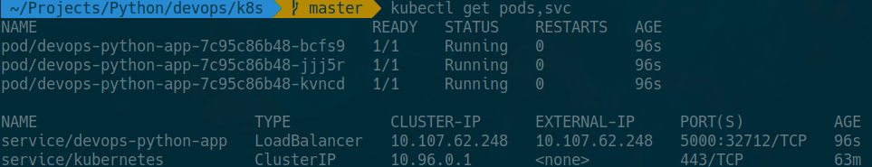

# Kubernetes labs

Labs 9 & 10 of devops course on Kubernetes topic.

## Installation

First of all, we need to install `kubectl` and `minikube`. 
I used Arch linux as host system and here is the command for installation:

``` sh
sudo pacman -Sy kubectl minikube
```

## Manual deployment

1. Start minikube:

``` sh
minikube start
```

2. Create docker image deployment:

``` sh
>>> kubectl create deployment devops-app --image=dantara/devops-python-app:latest
deployment.apps/devops-app created
```

3. Check deployment status:

``` sh
>>> kubectl get pods
NAME         READY   UP-TO-DATE   AVAILABLE   AGE
devops-app   1/1     1            1           23s
```

4. Start `minikube` tunnel:

``` sh
>>> minikube tunnel
```

5. Expose port:

``` sh
>>> kubectl expose deployment devops-app --type=LoadBalancer --port=5000
```

6. Check exposed ports and connection:

``` sh
>>> kubectl get services
NAME         TYPE           CLUSTER-IP      EXTERNAL-IP     PORT(S)          AGE
devops-app   LoadBalancer   10.99.249.135   10.99.249.135   5000:30049/TCP   31s
kubernetes   ClusterIP      10.96.0.1       <none>          443/TCP          3m33s

>>> kubectl get pods,svc
NAME                              READY   STATUS    RESTARTS   AGE
pod/devops-app-78f454c46b-whqfr   1/1     Running   0          2m15s

NAME                 TYPE           CLUSTER-IP      EXTERNAL-IP     PORT(S)          AGE
service/devops-app   LoadBalancer   10.99.249.135   10.99.249.135   5000:30049/TCP   40s
service/kubernetes   ClusterIP      10.96.0.1       <none>          443/TCP          3m42s

>>> minikube service devops-app
|-----------|------------|-------------|---------------------------|
| NAMESPACE |    NAME    | TARGET PORT |            URL            |
|-----------|------------|-------------|---------------------------|
| default   | devops-app |        5000 | http://192.168.49.2:30049 |
|-----------|------------|-------------|---------------------------|
🎉  Opening service default/devops-app in default browser...
Opening in existing browser session.

>>> curl 192.168.49.2:30049
<center><h1>Current time in Moscow is 22:41:28</h1></center>%  
```


7. Clean up:

``` sh
>>> kubectl delete deployment devops-app
deployment.apps "devops-app" deleted

>>> kubectl delete service devops-app
service "devops-app" deleted
```

## Automatized deployment

1. Run deployment:

``` sh
>>> kubectl apply -f ./
deployment.apps/devops-python-app-deployment created
service/devops-python-app-service created
```

2. Check status and connection:

``` sh
>>> kubectl get pods,svc
NAME                                                READY   STATUS    RESTARTS   AGE
pod/devops-python-app-deployment-6c96b66787-7vs2f   1/1     Running   0          29m
pod/devops-python-app-deployment-6c96b66787-ft6sc   1/1     Running   0          29m
pod/devops-python-app-deployment-6c96b66787-smkx7   1/1     Running   0          29m

NAME                                TYPE           CLUSTER-IP       EXTERNAL-IP      PORT(S)          AGE
service/devops-python-app-service   LoadBalancer   10.107.146.219   10.107.146.219   5000:32198/TCP   29m
service/kubernetes                  ClusterIP      10.96.0.1        <none>           443/TCP          48m

>>> minikube service devops-python-app-service
|-----------|---------------------------|-------------|---------------------------|
| NAMESPACE |           NAME            | TARGET PORT |            URL            |
|-----------|---------------------------|-------------|---------------------------|
| default   | devops-python-app-service |        5000 | http://192.168.49.2:32198 |
|-----------|---------------------------|-------------|---------------------------|
🎉  Opening service default/devops-python-app-service in default browser...
Opening in existing browser session.

>>> curl 192.168.49.2:32198
<center><h1>Current time in Moscow is 22:51:21</h1></center>%  
```


## Helm deployment

1. Create chart template:

``` sh
>>> helm create devops-python-app
Creating devops-python-app
```

2. Update newly created chart. You can find updated chart in `devops-python-app` folder.

3. Pack updated chart:

``` sh
>>> helm package devops-python-app
Successfully packaged chart and saved it to: /dantara/Projects/Python/devops/k8s/devops-python-app-0.1.0.tgz
```

4. Install your package:

``` sh
>>> helm install devops-python-app ./devops-python-app-0.1.0.tgz
NAME: devops-python-app
LAST DEPLOYED: Mon Sep 20 23:30:00 2021
NAMESPACE: default
STATUS: deployed
REVISION: 1
```

5. Check up your deployment:

``` sh
>>> kubectl get pods,svc
NAME                                     READY   STATUS    RESTARTS   AGE
pod/devops-python-app-7c95c86b48-bcfs9   1/1     Running   0          96s
pod/devops-python-app-7c95c86b48-jjj5r   1/1     Running   0          96s
pod/devops-python-app-7c95c86b48-kvncd   1/1     Running   0          96s

NAME                        TYPE           CLUSTER-IP      EXTERNAL-IP     PORT(S)          AGE
service/devops-python-app   LoadBalancer   10.107.62.248   10.107.62.248   5000:32712/TCP   96s
service/kubernetes          ClusterIP      10.96.0.1       <none>          443/TCP          63m
```

6. Check up your connection:

``` sh
>>> minikube service devops-python-app
|-----------|-------------------|-------------|---------------------------|
| NAMESPACE |       NAME        | TARGET PORT |            URL            |
|-----------|-------------------|-------------|---------------------------|
| default   | devops-python-app | http/5000   | http://192.168.49.2:32712 |
|-----------|-------------------|-------------|---------------------------|
🎉  Opening service default/devops-python-app in default browser...
Opening in existing browser session.

>>> curl 192.168.49.2:32712 
<center><h1>Current time in Moscow is 23:31:58</h1></center>%
```


