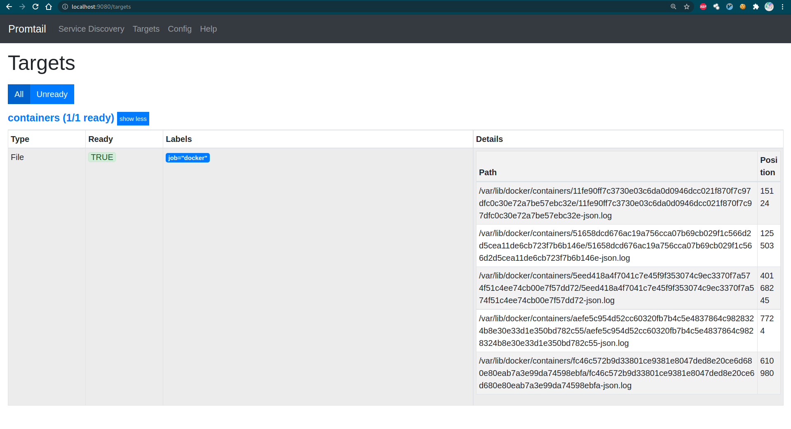
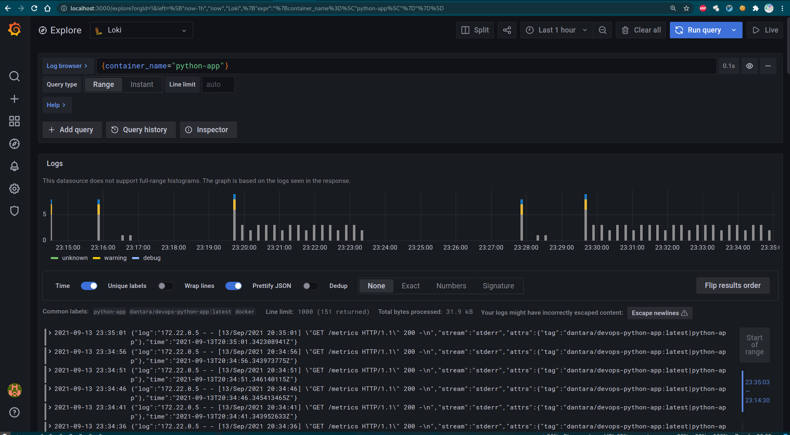

# Logging

## Best practices
- Use static labels
- Label values must be bounded
- Be aware of dynamic labels applied by third-party
- Use dynamic labels sparingly
- Use common log format for applications
- Backup long-term logs in external storage (Kafka as example).

## Screenshots
Promtail:

Loki in Grafana:

Prometheus:

Prometheus in Grafana:

